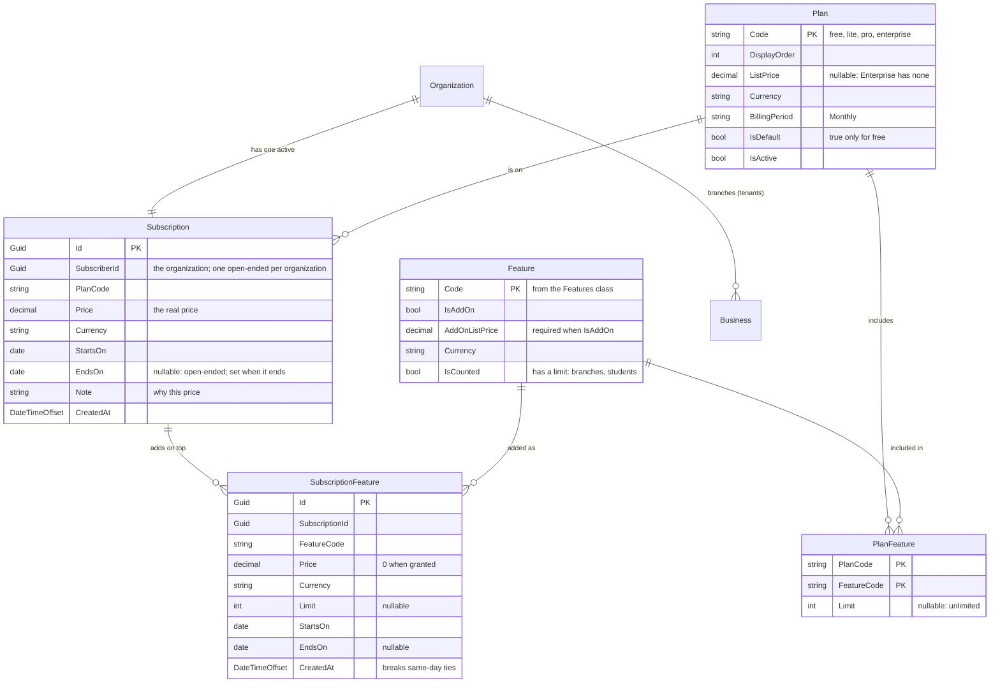
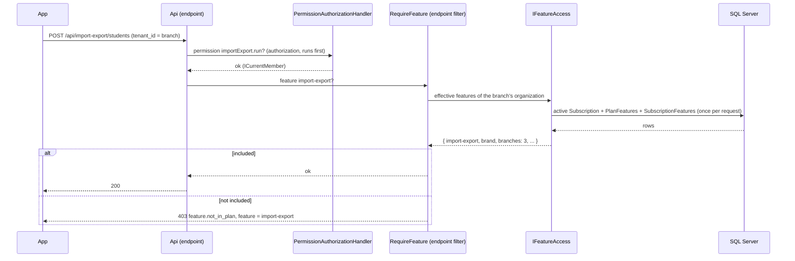

# Backend plan — Subscriptions, plans and features

Status: steps 1–4 built (every feature and limit enforced centrally, a 30-day `Free` trial, read-only brands once their subscription ends, the app shows the trial, the plans, usage and locks); step 5 (operator script) is next; see [Steps](#steps). Closes the "Pricing model" [open decision](../../mvp-plan.md#open-decisions) for the MVP; the prices and the exact split of features per plan are placeholders for the owner to decide.

## Goal

- Every brand has **one subscription**, and that subscription has a **plan**: `Free`, `Lite`, `Pro` or `Enterprise`.
- What a plan gives is a set of **features**. Some features can also be bought on their own as **add-ons**.
- The API refuses a feature the subscription doesn't have, the same way it refuses a missing permission, and the app shows it as locked.
- No online billing yet: the platform operator sets plans and prices by hand. Charging cards comes later and plugs into the same model.

## Decisions

### The subscription belongs to the organization, not to the branch

- `Organization` is the brand ("empresa máster") and `Business` is the branch and the tenant ([authorization](../../authorization.md)). The subscription hangs from the organization, so **every branch of a brand has the same plan**.
- This matches how a brand is run: the brand owner pays and decides, a branch never sees a pricing screen, and creating a branch can't start a second bill.
- Limits that depend on the number of branches (for example "up to 3 branches") are features of the brand's plan, so they are checked in one place.
- A franchise where each branch pays its own bill is not a brand here: each franchisee signs up as their own organization. If that changes, `Subscription` gets an optional `BusinessId` later; nothing in this plan blocks it.
- A solo instructor is an organization with one branch, so nothing special is needed for them.

### Four plans

| Plan | Who it is for | Price shown |
|---|---|---|
| `Free` | A **30-day trial** for every new sign-up, with limits | 0 |
| `Lite` | One instructor or a small studio | Placeholder |
| `Pro` | A studio with a team, a shop and its own brand | Placeholder |
| `Enterprise` | Brands with several branches; agreed by hand | "Consultar" (no list price) |

Four is enough: fewer and `Lite` and `Pro` merge into one plan that is either too cheap for studios or too expensive for instructors; more and the plan screen needs a comparison table nobody reads. Plan codes are stable identifiers (`free`, `lite`, `pro`, `enterprise`); the display name is UI copy.

### `Free` is a trial, and an ended subscription makes the brand read-only

- A brand that never pays still costs storage and support, so `Free` is not forever: it lasts `Plan.DurationInDays` (30), and sign-up sets the subscription's `EndsOn` to the last day. 30 rather than 15 because the business runs on monthly fees: a month is enough to collect one full round of them, which is what convinces an owner. Changing the length is an update of the plan row, no deploy.
- **No active subscription means read-only.** Every change (any authenticated request that isn't `GET`, `HEAD` or `OPTIONS`) answers `403 subscription.inactive` until the operator gives the brand `Lite`, `Pro` or `Enterprise`. Reads keep working, so the owner still sees students, classes and payments and nothing is lost.
- The same rule covers a paid plan that stops being paid: the operator ends the subscription and the brand turns read-only. There is no automatic fallback to `Free` after a trial or a paid plan ends.
- Anonymous endpoints (sign-in, refresh, sign-out, branch switch, invitations) keep working, and an endpoint can opt out with `.AllowInactiveSubscription()`.
- The check is a middleware after authorization (`UseActiveSubscriptionForChanges`), so a member without the permission still gets the permission's `403` first.
- Downgrading (for example `Enterprise` to `Lite`) is a new active subscription: the brand keeps writing, only the actions the smaller plan doesn't include are refused, and existing data stays.

### The plan's price is a list price; the subscription holds the real one

- `Plan.ListPrice` is what the app shows before subscribing ("desde …").
- `Subscription.Price` is what this brand actually pays, copied from the list price when the subscription is created and editable afterwards. Changing a list price never changes what existing customers pay.
- That is how the pilot instructor gets **`Enterprise` at 0**: a normal subscription with `Price = 0` and a `Note` ("Pilot, DF Swimming"). No special case in code, and later it becomes a discount or an end date (`EndsOn`) without a migration.
- Every price has a currency (`ARS`, `EUR`, `USD`): the pilot is in Spain and the target market is Argentina.

### Features, and an add-on is a feature with a price

Add-ons are not a separate concept: an add-on is a **feature that can also be bought on its own**.

- `Feature` is a catalog entry (`import-export`, `brand`, `shop`, …).
- `PlanFeature` says which features a plan includes, and, for counted features, the limit (`Limit = 3` branches; `null` is unlimited).
- A feature with `IsAddOn = true` has an `AddOnListPrice`, and a brand on a plan that doesn't include it can still get it through `SubscriptionFeature`. A feature that is not an add-on has no price: the only way to get it is a plan that includes it.
- `SubscriptionFeature` is **what the brand has on top of its plan**: a bought add-on with its agreed price, or a feature granted by hand at 0 (for example, to let a customer try `shop` for a month, with `EndsOn`). It can also change a limit, up or down (`Limit = 5` branches, or 100 students for an Enterprise brand that agreed to them).
- **Effective features = the plan's features, overridden by the subscription's active features.** An active `SubscriptionFeature` replaces the plan's limit for that feature, whether higher or lower; when several are active for the same feature, the one with the latest `StartsOn` (a date) wins, and on the same day the last one created (`CreatedAt`, only to break the tie). So a limit is raised or lowered by adding a new row dated today, or scheduled with a future `StartsOn`, without depending on which value is larger. Included features are not copied into each subscription, so improving a plan improves it for everyone on it. Grandfathering an old plan, if it's ever needed, is a new plan code.

### Features are checked like permissions, and both must pass

- **Features live in code, plans live in data** — the same split as permissions and roles. The catalog is a constants class (`Features`) because endpoints and use cases reference the codes; which plan includes what, and the prices, are rows, so they change without a deploy.
- A request needs **the permission (who you are in the branch) and the feature (what the brand pays for)**. The brand owner on `Free` can't import; a coach on `Enterprise` still can't see money.
- **Nothing is checked in the use cases.** Three central places cover every endpoint:

| What | Where | Answer |
|---|---|---|
| Subscription ended | `UseActiveSubscriptionForChanges` middleware: every authenticated change | `403 subscription.inactive` |
| On/off features | `FeatureGatedPermissions` (Core) maps action permissions to the feature that unlocks them (`products.manage` → `shop`, `classPacks.sell` → `class-packs`, `importExport.run` → `import-export`, …). `PermissionAuthorizationHandler` refuses a permission the role has but the plan lacks | `403 feature.not_in_plan` |
| Endpoints whose permission is shared with free actions | `.RequireFeature(...)`: brand changes (`business.manage` also edits settings) and the family app (`/api/family`, family invitations) | `403 feature.not_in_plan` |
| Counted limits | `FeatureLimitSaveChangesInterceptor`: before saving, counts the added `Student`, `MemberInvitation` (not for branch owners) and `Business` rows and the existing ones (`SubscriptionLimits` in Infrastructure); every path that creates them is covered, imports included | `403 feature.limit_reached` (`FeatureLimitReachedException`, `FeatureLimitExceptionHandler`) |

- Every endpoint already declares a permission, so a new action endpoint is gated as soon as its permission is in the table. A test checks every gate names a known permission and feature, and another that every `RequireFeature` code is in the catalog.
- **The front prevents the normal case; the interceptor is the safety net.** `GET /api/me` returns `used` for counted features, and the app locks "Nuevo alumno", "Invitar" and "Nueva sede" at the limit. The interceptor only answers in races (two devices adding the last seat), with stale screens or direct API calls. The import preview is the one place the front can't know in advance, so it reports `planLimit` (`{ featureCode, remaining }`) and the import refuses with `feature.limit_reached` before saving.
- **Unlimited is `null`.** Enterprise has no limit on students, branches or team, and the interceptor doesn't even count them. An add-on with `Limit = null` lifts a plan's limit for one brand, and an add-on with a number sets one, even on Enterprise.
- Read rules that depend on the plan stay in the read use case: without `brand`, `GET /api/business/brand` drops the colors, the lock and the logo, so the theme stops applying while the data stays.
- The app mirrors the table (`featureGatedPermissions.ts`): `useCan` is plan-aware, so buttons for actions the plan lacks disappear everywhere `useCan` is used; `useRoleCan` keeps the role-only check for entries that should open a lock notice instead (Importar y exportar).
- **Gates block actions, not reads.** Creating, editing, importing and exporting need the feature; listing what already exists doesn't, so a brand that drops to a smaller plan still sees its data. Deleting a custom role stays allowed too, so a downgraded brand can clean up.
- A missing feature returns `403` with the code `feature.not_in_plan` (and `feature.limit_reached` for limits) and the feature code in `feature`, never the permission's code, so the app can offer an upgrade instead of acting as if the button didn't exist.
- Effective features are read once per request, like permissions, so a plan change applies on the next request.

### Downgrades never delete data

- When a brand drops to a smaller plan, nothing is deleted: brand colors stay stored and stop applying ([branding and plans](../../branding-and-plans.md)), extra branches stay readable, imports stop.
- A limit blocks **creating** past it, never existing data: a brand with 4 branches that drops to a 1-branch plan keeps all 4 and can't create a fifth.

## Model

- A plan change closes the current subscription (`EndsOn`) and opens a new one, so the history of who paid what stays. A filtered unique index keeps one active subscription per organization.
- None of these tables are tenant-owned: like `Organizations`, they sit above the branches and are never filtered by `TenantId`.
- `Feature` rows mirror the `Features` class; a test fails when a code exists in one and not the other.

## How a request is checked

`RequireFeature` is an endpoint filter, not an authorization policy: authorization already has the app's `permission:` policy provider, and a filter can answer with the problem body (`code`, `feature`) the app needs to show an upgrade. It also adds `RequiredFeatureMetadata`, and a test checks every required code is in `Features.All`.

## Feature catalog and split (first version, placeholders)

The daily core — students, families, class groups, enrollments, attendance, monthly fees — is never a feature: every plan has it, otherwise `Free` is useless.

| Feature | Counted | `Free` | `Lite` | `Pro` | `Enterprise` | Add-on |
|---|---|---|---|---|---|---|
| `students` (students of the branch) | yes | 30 | 150 | unlimited | unlimited | no |
| `branches` | yes | 1 | 1 | 3 | unlimited | yes, per extra branch |
| `team` (members of the branch besides its owners, pending invitations included) | yes | 0 | 2 | 10 | unlimited | no |
| `class-packs` and private lessons | | | ✓ | ✓ | ✓ | no |
| `import-export` | | | ✓ | ✓ | ✓ | yes |
| `custom-roles` | | | | ✓ | ✓ | no |
| `family-app` (family accounts, avisos) | | | | ✓ | ✓ | yes |
| `shop` (products and orders) | | | | ✓ | ✓ | yes |
| `brand` (brand theme, logo, theme lock) | | | | ✓ | ✓ | yes |
| Future paid features (online payments, reports, …) | | | | | | yes, priced |

## Library or part of Core?

**A separate library, like `Security`**: `src/Subscriptions` and `src/Subscriptions.AspNetCore`, with a new analyzer rule **ARCH007** (no `using` of `Core`, `Infrastructure`, `Api`, `Security`, `Tenancy`, `ImportExport` or `Notifications`).

Why:

- The mechanism has no class-manager concept in it. A subscription belongs to an opaque **subscriber id**; the library doesn't know it's an organization. Plans, features, add-ons, effective features, limits and `RequireFeature` are the same in any SaaS built from the template.
- The repository already works this way (`Security`, `Tenancy`, `ImportExport`, `Notifications`) and has the analyzers to keep the boundary. The boundary is cheap now and expensive to add once subscription code is spread over `Core`.
- It is the next candidate for the template ([README](../../../README.md)): build it here, then port it to `app-template` once it has run in the pilot.

What stays in the app:

| Library (`Subscriptions`, no dependencies) | Library (`Subscriptions.AspNetCore`) | App |
|---|---|---|
| `Plan`, `Feature`, `PlanFeature`, `Subscription`, `SubscriptionFeature`; `EffectiveFeatures` (plan overridden by the latest active add-on, dates); `IFeatureAccess`, `ISubscriberResolver`; `FeatureErrorCodes` | `ApplySubscriptionsModel()` (tables in schema `billing`) and `ISubscriptionsDbContext`; `FeatureAccess` (once per request; no active subscription means inactive, with no features); `UseActiveSubscriptionForChanges()` middleware; `RequireFeature(...)` endpoint filter; `AddSubscriptions<TDbContext, TSubscriberResolver>()` | `Features` and `PlanCodes` in `Core`; plan rows and prices (`SubscriptionCatalogSeed`); `OrganizationSubscriberResolver` (tenant → organization); the subscription at sign-up; limit checks in use cases; `GET /api/me` and the app screens |

- **The app's `AppDbContext` holds the tables**, applying the library's model like it applies the tenant query filters, instead of a `SubscriptionsDbContext` of its own. One migration history, the foreign key from `Subscriptions.SubscriberId` to `Organizations` (added by the app, since the library doesn't know organizations), and sign-up writes the subscription in the same transaction. `Security` has its own context because of Identity; this library has no such reason.
- **`Core` references `Subscriptions`**, the same as it references `Tenancy` and `Notifications`: the project has no dependencies, and use cases need `IFeatureAccess` for limits. `Core` never references `Subscriptions.AspNetCore`.

## API

| Operation | Endpoint | Who |
|---|---|---|
| The brand's plan, price, features and limits with usage | `GET /api/organization/subscription` | `subscription.view` (brand only) |
| Effective feature codes and limits, for the app to lock things | added to `GET /api/me` (`features`) | any member |
| Public plans with list prices, for the sign-up and plan screens | `GET /api/plans` | anonymous |

No endpoint changes a subscription in the MVP: there is no platform administrator role yet. The operator runs `scripts/set-subscription.cs <connection> <organizationId> <plan> <price> <currency> [note]` (and `add-feature`), the same style as `scripts/seed-demo-business.cs`. A platform admin screen comes with online billing.

## In the app

Built in `app/src/features/subscriptions`:

- `useSubscription()`, `useFeature(code)` and `useAllowsAnother(code, count)` next to `useCan(...)`, fed by `subscription` in `GET /api/me`.
- **Permissions hide, features lock.** A button the member's role doesn't allow is hidden; a feature the plan doesn't include shows a lock notice with "Ver planes": Importar y exportar, creating or copying custom roles, and a new branch past the limit.
- **Trial:** Inicio shows the days left with "Ver planes".
- **Ended:** `SubscriptionGate` (in the team tabs layout) replaces the app with "Tu prueba gratis terminó" / "Tu plan terminó", the plans and the contact; "Ver mis datos" opens the app read-only, and Inicio keeps a notice. A mutation refused with `subscription.inactive` or `feature.*` reloads `GET /api/me`, so a subscription that ends while the app is open shows the gate.
- **Ajustes → Plan** (also under Inicio, so it never leaves the tab): current plan and status, the real price for brand owners (`GET /api/organization/subscription`), what it includes, every plan from `GET /api/plans`, and the contact.
- The contact opens `EXPO_PUBLIC_PLANS_CONTACT_URL` (for example a WhatsApp link); without it the screens say "escribinos" as text.
- Ajustes → Plan shows usage of counted features ("Alumnos: 24 de 30", "Sedes: 2 · sin límite").
- Sign-up shows nothing about plans: everyone starts the `Free` trial. The app shows the days left, and once it ends, a screen to choose a plan instead of errors on every change.

## Migration

- Create the `billing` schema, the five tables, the `Feature` rows and the four plans with their features.
- Every **existing** organization gets `Enterprise` at 0 with the note "Pilot": today that is DF Swimming, and the pilot keeps everything it already uses (brand, shop, family app, three branches).
- New sign-ups get the default plan (`Free`, 30 days) from then on. `AddPlanDuration` gives `Free` its 30 days and ends the `Free` subscriptions created before it 30 days after they started. The setting `Subscriptions:SignUpPlan` overrides it with another plan code: the e2e tests use `enterprise` so their flows don't depend on plan limits, and a launch promotion could use it too. Leave it unset in production unless that is the intent.
- `scripts/seed-demo-business.cs` gives the demo brand `Enterprise` at 0.

## Steps

1. ✅ `src/Subscriptions` + ARCH007 + unit tests of effective features (the latest add-on overrides the plan, expired add-on ignored).
2. ✅ `Subscriptions.AspNetCore`: model, migration with the seed, `RequireFeature`, `FeatureAccess`; sign-up creates the `Free` subscription; existing organizations get `Enterprise` at 0; a branch of brand A never reads brand B's subscription.
   - ✅ `Free` lasts 30 days; an ended subscription makes the brand read-only (`403 subscription.inactive`).
3. Gate the features in the table:
   - ✅ Every feature in the table: permission gates, `RequireFeature` for brand and family app, and the students, team and branches limits in the interceptor; usage in `/api/me`, locks in the app, and the import preview's room left.
4. ✅ `subscription` in `GET /api/me`, `GET /api/organization/subscription` (brand-only `subscription.view`), `GET /api/plans`; app: hooks, trial notice, ended gate, locks and Ajustes → Plan.
5. `scripts/set-subscription.cs` and a runbook in `docs/`.

## Later, not in the MVP

- Online billing (Mercado Pago / Stripe subscriptions): webhooks set `EndsOn`, and a `Status` column (`PastDue`, grace period) arrives with them; until then `EndsOn` alone says whether a subscription is active.
- A trial with `Pro` features instead of `Free` limits, if conversions ask for it: the sign-up plan setting and `DurationInDays` already allow it.
- Yearly billing (`BillingPeriod = Yearly`), coupons, and a platform admin screen.
