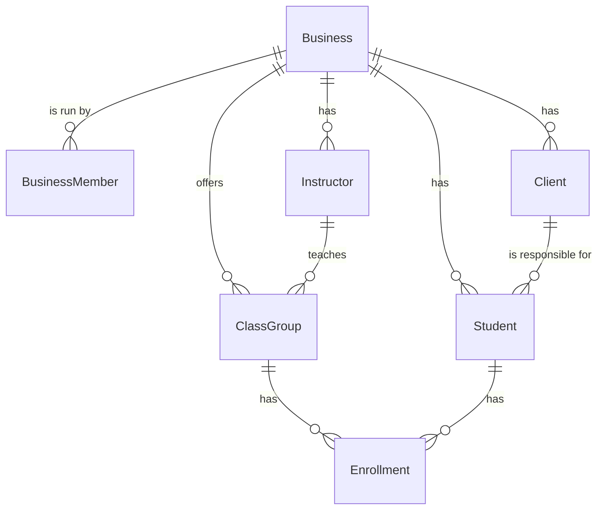

# Domain model

Entities, invariants and tenancy rules. Everything here lives in `src/Core/Domain` and has no dependency on EF Core or ASP.NET.

## Principles

- **Entities protect their own invariants.** They are created through a static `Create(...)` factory that returns `Result<TEntity>`; properties have private setters. An invalid entity cannot exist in memory.
- **Identifiers are `Guid` version 7** (`Guid.CreateVersion7()`): sortable by creation time and index-friendly in SQL Server.
- **Time is stored as UTC `DateTimeOffset`.** Conversions to local time use the business's `TimeZoneId`. Current time always comes from `TimeProvider`, never `DateTimeOffset.UtcNow`, so tests control the clock.
- **Money is `decimal`**, in the business's currency, with 2 decimal places.
- **Validation limits are constants** in the entity (for example `Client.FullNameMaxLength`), reused by EF Core configuration and by use case validation.

## Entities



### Business (tenant root)

| Property | Type | Rules |
|---|---|---|
| `Id` | `Guid` | v7 |
| `Name` | `string` | Required, 2–120 characters |
| `Slug` | `string` | Required, unique globally, lowercase, 3–80 characters |
| `TimeZoneId` | `string` | IANA id, for example `America/Argentina/Buenos_Aires` |
| `DefaultCountryCallingCode` | `string` | 1–3 digits, for example `54`; used to normalize local phone numbers |
| `CurrencyCode` | `string` | ISO 4217, 3 letters, for example `ARS`; normalized to upper case |
| `CreatedAt` | `DateTimeOffset` | UTC |

`Business` is the only entity that does **not** implement `ITenantOwned`.

### BusinessMember

Links a user account to a business with a role. For now every business has exactly one member, the owner.

| Property | Type | Rules |
|---|---|---|
| `Id` | `Guid` | v7 |
| `TenantId` | `Guid` | Tenant (the business) |
| `UserId` | `Guid` | Identity user id (user accounts live in `SecurityDbContext`, schema `identity`) |
| `Role` | `BusinessRole` | `Owner` for now; add roles as the app needs them |

Unique `(TenantId, UserId)`. The access token carries the member's `TenantId` as the `tenant_id` claim and the role as `role`.

### Client

| Property | Type | Rules |
|---|---|---|
| `Id` | `Guid` | v7 |
| `TenantId` | `Guid` | Tenant (the business) |
| `FullName` | `string` | Required, trimmed, 2–120 characters |
| `PhoneNumber` | `PhoneNumber` | Required, normalized, **unique per business** |
| `Email` | `string?` | Optional, valid format, max 254 characters |
| `Notes` | `string?` | Optional, max 1000 characters  |
| `CreatedAt` | `DateTimeOffset` | UTC |

### Student (added in M1)

The person who attends classes. The client is who pays and is contacted; an adult who attends is a client with one student of the same name.

| Property | Type | Rules |
|---|---|---|
| `Id` | `Guid` | v7 |
| `TenantId` | `Guid` | Tenant (the business) |
| `ClientId` | `Guid` | Required; the client must belong to the same business |
| `FullName` | `string` | Required, trimmed, 2–120 characters, **unique per client** |
| `BirthDate` | `DateOnly?` | Optional, from 1900-01-01 to today in the business's time zone |
| `Notes` | `string?` | Optional, max 1000 characters (for example "afraid of deep water") |
| `CreatedAt` | `DateTimeOffset` | UTC |

Indexes: unique `(TenantId, ClientId, FullName)` and `(TenantId, FullName)` for search.

### Instructor (added in M2)

| Property | Type | Rules |
|---|---|---|
| `Id` | `Guid` | v7 |
| `TenantId` | `Guid` | Tenant (the business) |
| `FullName` | `string` | Required, trimmed, 2–120 characters, **unique per business** |
| `IsActive` | `bool` | Can't be deactivated while teaching active class groups |

Sign up creates the owner as the first instructor.

### ClassGroup (added in M2)

A weekly recurring class, for example "Natación inicial, Tuesday and Thursday 18:00, 45 minutes, 8 spots".

| Property | Type | Rules |
|---|---|---|
| `Id` | `Guid` | v7 |
| `TenantId` | `Guid` | Tenant (the business) |
| `Name` | `string` | Required, trimmed, 2–80 characters |
| `InstructorId` | `Guid` | An active instructor of the same business |
| `Weekdays` | `ClassWeekdays` | Flags (`Monday = 1 … Sunday = 64`), at least one; stored as `int` |
| `StartTime` | `TimeOnly` | Wall-clock time in the business's time zone, stored as `time`, never converted to UTC |
| `DurationMinutes` | `int` | 15–240, multiple of 5, ends by midnight |
| `Capacity` | `int` | 1–100 |
| `Location` | `string?` | Optional, max 80 characters |
| `IsActive` | `bool` | Inactive groups are hidden from the weekly view |

`ClassSchedule` (weekdays, start time, duration) is the value object behind it: it validates the time rules and answers `OverlapsWith` (shares a weekday and the time ranges intersect; touching ends don't overlap). An instructor can't teach two active class groups that overlap.

### Enrollment (added in M3)

A student in a class group from a date until they leave.

| Property | Type | Rules |
|---|---|---|
| `Id` | `Guid` | v7 |
| `TenantId` | `Guid` | Tenant (the business) |
| `StudentId` | `Guid` | A student of the same business |
| `ClassGroupId` | `Guid` | An active class group of the same business when enrolling |
| `StartDate` | `DateOnly` | Defaults to today in the business's time zone |
| `EndDate` | `DateOnly?` | Last day attended; `null` while enrolled; never before `StartDate` (ending before the start deletes the enrollment) |
| `CreatedAt` | `DateTimeOffset` | UTC |

An enrollment is **current** on a date when `EndDate` is `null` or on/after that date. A student has at most one open enrollment per class group (filtered unique index `(TenantId, StudentId, ClassGroupId) WHERE EndDate IS NULL`), and current enrollments never exceed the class group's capacity (checked in the use case). A class group with current enrollments can't be deactivated, and its capacity can't drop below them.

"Today" comes from `IBusinessCalendarService`, which applies the business's time zone to `TimeProvider`.

## Value objects

### PhoneNumber

- Created with `PhoneNumber.Create(string? rawValue, string defaultCountryCode)` returning `Result<PhoneNumber>`.
- Strips spaces, dashes, dots and parentheses; keeps an explicit `+` or `00` international prefix; otherwise drops the leading trunk `0` and adds the business's `DefaultCountryCallingCode`; stores E.164 (`11 2233-4455` → `+541122334455`).
- No country-specific rules: the Argentine mobile `9` is not inserted. Numbers entered with it (`+54 9 11 ...`) are kept as entered.
- Two phone numbers are equal when their normalized values are equal. That is what makes the uniqueness rule reliable.
- Persisted as a single `nvarchar(20)` column via an EF Core value converter.

## Multi-tenancy

One database for all businesses. Isolation is enforced centrally, never by remembering to add a `Where`.

```text
Tenancy/                    (no dependencies, referenced by Core)
  ITenantOwned.cs           → Guid TenantId { get; }
  ITenantContext.cs         → Guid TenantId { get; }  (the current request's business)

Tenancy.AspNetCore/
  Persistence/TenantModelBuilderExtensions.cs        → global query filter for every ITenantOwned entity
  Persistence/TenantStampingSaveChangesInterceptor.cs → sets TenantId on Added entities;
                                                       throws if a Modified entity belongs to another business
  Claims/ClaimsTenantContext.cs                      → reads the tenant_id claim
```

The mechanism has no business concepts so other apps can reuse it; see [tenancy.md](../tenancy.md).

Rules:

- Every tenant-owned table has a `TenantId` column (the business) and an index that **starts** with `TenantId` (for example `IX_Clients_TenantId_PhoneNumber`, unique).
- Every unique rule is scoped per business, for example `(TenantId, PhoneNumber)`.
- `IgnoreQueryFilters()` is forbidden outside `Infrastructure`. Enforced by the Roslyn analyzer ARCH002 (see [analyzers.md](../analyzers.md)).
- Every new tenant-owned entity needs an integration test in `When_<entity>_belongs_to_another_business/Then_it_is_not_returned.cs`.
- `ITenantContext` is `ClaimsTenantContext`: it reads the `tenant_id` claim of the signed-in user in every environment. HTTP tests authenticate with a real token issued for a test owner; `FixedTenantContext` is used for direct database access.
- Sign up creates a business before any token exists, so the use case calls `ITenantScope.Establish(tenantId)` for the new business; the stamping interceptor then accepts the owner's `BusinessMember`. A request can only establish one business.
- Sign in and refresh look up `BusinessMember` by user id with `IgnoreQueryFilters()` inside `Infrastructure` (`BusinessMemberRepository`), because there is no tenant yet.
- A missing or invalid tenant surfaces as `TenantNotResolvedException`, which the global exception handler maps to `401 ProblemDetails`.

## Persistence abstractions

`Core` defines what it needs; `Infrastructure` implements it with EF Core. One interface per aggregate, containing only the methods the use cases need (interface segregation), and no generic repository.

```text
Core/Abstractions/Persistence/
  IClientRepository.cs
  IStudentRepository.cs
  IInstructorRepository.cs
  IClassGroupRepository.cs
  IEnrollmentRepository.cs
  IBusinessRepository.cs
  IBusinessMemberRepository.cs
  IUnitOfWork.cs         → Task SaveChangesAsync(CancellationToken)
```
