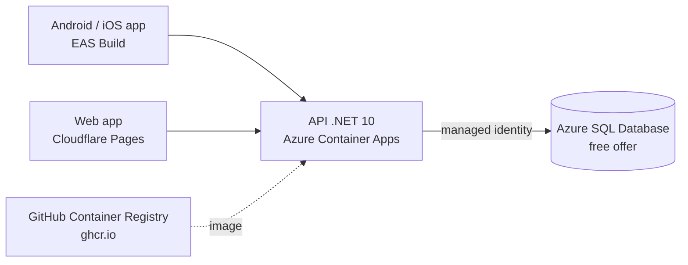

# Hosting plan

Date: 2026-09-24

How to host class-manager for free while it is in the pilot stage, and what to watch so it stays free. The exact commands are in the [pilot deployment runbook](pilot-deployment.md).

## Decision

Host on **Azure** during the pilot. Revisit when the first businesses pay.

| Option | Why not (for the pilot) |
|---|---|
| AWS Free plan | New accounts (since July 2025) get up to USD 200 in credits for **6 months**; then the account closes unless upgraded. The pilot would have to migrate or start paying right when it starts being used. |
| Azure | Free offers below have **no end date**. SQL Server and .NET are first-party. |

Limits checked on 2026-09-24. Free offers change often: re-check them before relying on them.

## Architecture



| Piece | Service | Free allowance |
|---|---|---|
| Database | Azure SQL Database, free offer (serverless) | 100,000 vCore-seconds, 32 GB data and 32 GB backups per database per month, up to 10 databases per subscription, no expiry |
| API | Azure Container Apps, consumption plan | 180,000 vCPU-seconds, 360,000 GiB-seconds and 2 million requests per subscription per month; nothing is billed while scaled to zero |
| Container image | GitHub Container Registry (`ghcr.io`), private package | Included in the GitHub plan's Packages storage; avoids Azure Container Registry, which has no free tier |
| Web app | Cloudflare Pages | 500 builds per month, 1 concurrent build |
| Mobile builds | Expo EAS, free plan | 15 Android + 15 iOS builds per month |

## What "free" really means here

- **100,000 vCore-seconds is about 28 vCore-hours per month.** The database only consumes while it is active and auto-pauses when idle. That covers development, demos and one or two pilot businesses with light use. A business using the app all day exhausts it in days.
- **When the database allowance runs out**, keep the default behavior: auto-pause until next month. Switching to "bill over usage" is a deliberate decision, not a default.
- **Scale to zero means cold starts.** The first request after a quiet period takes a few seconds (API container start + database resume). Acceptable for a pilot; not for production.
- **Production will cost money** on any cloud. The API is a container, so moving providers later is cheap.

## Prerequisite: authentication

Every endpoint except `/api/auth/*` and `/health` requires a JWT whose `tenant_id` claim selects the business. The API may be published once the JWT signing key below is configured; without it the API refuses to start.

## Setup steps

Commands use the Azure CLI (`az`). Names are suggestions; `<region>` is decided when the hosting is created (see [Region](#region)).

### Region

The region is not fixed in advance: choose it when creating the resources, based on where the customers are at that moment.

- **Data protection law first.** If any customer is in the European Union, personal data (students, often minors, and their parents) must be hosted in an EU region to comply with GDPR. Other countries may have their own residency rules: check them before choosing.
- **Then latency.** Among the allowed regions, pick the one closest to the customers.
- **One region for every tenant.** All tenants share a single database, so the region must satisfy the strictest requirement among the customers. Serving customers with incompatible requirements means a separate deployment per region.
- **Check the free offers in that region.** Not every service or free offer is available in every region.
- **Changing it later is a migration.** Moving the database to another region means exporting and importing it, so choose with the expected customers in mind.

**Decision (2026-09-26): France Central (`francecentral`, Paris).** Customers are expected in Spain and Argentina. Hosting in the EU keeps Spanish customers' data inside the EU (GDPR), and Argentina's data protection rules accept EU countries as adequate destinations, so Argentine customers can be served from there too. The reverse (EU data in Brazil) would need extra transfer safeguards. Latency from Argentina is higher than from `brazilsouth`, which is acceptable for this app.

Regions tried first, on a new pay-as-you-go subscription:

| Region | Result |
|---|---|
| Spain Central | Serverless SQL exists, but the free offer is not: `ProvisioningDisabled`, "free limit database is not supported for provided service level objective or region" |
| North Europe | New SQL servers not accepted for this subscription: `RegionDoesNotAllowProvisioning` |
| France Central | Server and free database created |

Moving to Spain later (for example when paying for the database is acceptable) is a migration: convert the free database to a paid tier (a setting change; data stays), copy it to a server in Spain (`az sql db copy`, or export and import a `.bacpac`), then point a new container app at it. The free offer can't be copied directly, and a database converted to paid can't go back to the free offer.

### 1. Resource group and budget alert

```powershell
az group create --name class-manager-rg --location <region>
```

Create a **USD 1 monthly budget with an email alert** in Cost Management. It is the safety net if something stops being free.

### 2. Azure SQL Database (free offer)

- Create a logical server with **Microsoft Entra authentication only** (no SQL logins, no passwords to leak).
- Create the database with the **free offer** option (`--use-free-limit --free-limit-exhaustion-behavior AutoPause`).
- Firewall: allow Azure services; add the owner's IP only while running migrations from the PC.

### 3. Container image

- Add a `Containerfile` for the API (multi-stage: `sdk:10.0` build → `aspnet:10.0` runtime), as in knowledge-search.
- Build and push to `ghcr.io/alejandrolazarte/class-manager-api` from GitHub Actions using the built-in `GITHUB_TOKEN` (`permissions: packages: write` only on that job).

### 4. Azure Container Apps

- Create an environment on the consumption plan.
- Create the app from the `ghcr.io` image, with registry credentials stored as a Container Apps secret (a classic token with `read:packages` only: GitHub Packages doesn't accept fine-grained tokens).
- `minReplicas: 0`, `maxReplicas: 1` for the pilot.
- **JWT signing key:** generate at least 32 random bytes and store them as a Container Apps secret, exposed to the app as the environment variable `Authentication__Jwt__SigningKey` (a `secretref`, never a plain value). Issuer, audience and token lifetimes come from `appsettings.json`. The API validates the key at startup and does not start if it is missing or shorter than 32 bytes.

  ```powershell
  az containerapp secret set --name class-manager-api --resource-group class-manager-rg --secrets jwt-signing-key=<key>
  az containerapp update --name class-manager-api --resource-group class-manager-rg --set-env-vars Authentication__Jwt__SigningKey=secretref:jwt-signing-key
  ```

  Rotating the key signs every user out (existing access tokens stop validating; refresh tokens keep working and issue tokens with the new key). Rotate it if it may have leaked.
- The API trusts one `X-Forwarded-For` hop so the per-IP rate limit on `/api/auth/*` sees the real client behind the ingress. Keep ingress as the only way to reach the container.
- Enable a **system-assigned managed identity** and grant it access to the database (`CREATE USER [class-manager-api] FROM EXTERNAL PROVIDER`, then `db_datareader`, `db_datawriter`).
- Connection string without a password: `Server=tcp:<server>.database.windows.net;Database=ClassManager;Authentication=Active Directory Managed Identity;Encrypt=True`. Migrations from the pipeline or the PC use `Active Directory Default` instead (the Azure CLI sign-in).
- Logs: the environment is created without a Log Analytics workspace (`--logs-destination none`); live logs still stream with `az containerapp logs show`. SQL command logs are at `Warning` outside Development.

### 5. Database migrations

Run EF Core migrations as an explicit step (`scripts/migrate-database.mjs`, from the pipeline or the owner's PC), never automatically on API startup. The script applies both contexts: `AppDbContext` (business data) and `SecurityDbContext` (Identity users and refresh tokens, schema `identity`). See [local-development.md](backend/local-development.md#database-schema).

Don't run `scripts/seed-demo-business.cs` against the pilot database: businesses sign up themselves.

### 6. Web app (Cloudflare Pages)

- Build: `pnpm export:web` (`expo export --platform web` plus moving package assets out of `node_modules`, see [pilot deployment](pilot-deployment.md)), output `dist/`.
- Connect the GitHub repository through the Cloudflare Pages GitHub integration; it builds on Cloudflare, so no extra GitHub Action is needed.
- `EXPO_PUBLIC_API_BASE_URL` set to the Container Apps URL.
- Add the Pages domain to the API's CORS allowlist (configuration, not a hardcoded string).

### 7. Mobile app (pilot)

- Pilot businesses install the **web app as a PWA** from the browser ("Install app" on Android, "Add to Home Screen" on iPhone). It updates itself on every push to `main`, with no APK, no "unknown sources" permission and no store. See [pilot deployment](pilot-deployment.md#10-installing-the-app-on-phones-pwa).
- The app uses no native-only feature today: session and theme storage have web variants (`*.web.ts`, `localStorage`).
- The EAS `pilot` profile (an APK installed from a link) stays available but is not the default: Android asks to allow installs from unknown sources, which is too much friction for instructors.
- Store publishing (Google Play: USD 25 once; Apple: USD 99 per year) waits until the app leaves the pilot.

## Deployment pipeline

GitHub Actions only allows GitHub-owned actions (see [github-protection.md](github-protection.md)). Deploying to Azure therefore uses the Azure CLI preinstalled on the runner instead of `azure/login`:

- Authenticate with **OpenID Connect** (federated credential on an Entra app registration; no client secret stored in GitHub).
- If an Azure action becomes necessary, add it to the allowed actions **pinned by commit SHA** and document why in `github-protection.md`.

Flow (`.github/workflows/deploy.yml`): PR merged to `main` → CI green → push image to `ghcr.io` → migrations → `az containerapp update --image ...:<commit-sha>`.

## Security checklist

- [ ] No passwords: Entra-only SQL server + managed identity.
- [ ] No secrets in the repository or in GitHub; registry token and JWT signing key live in Container Apps secrets.
- [ ] JWT signing key: at least 32 random bytes, used only by this environment (never the local user-secrets key).
- [ ] HTTPS only (Container Apps default).
- [ ] CORS limited to the Pages domain.
- [ ] Budget alert active.

## Costs to watch

| Risk | Mitigation |
|---|---|
| Database exceeds free vCore-seconds | Auto-pause behavior; monitor usage in the portal |
| Log Analytics ingestion | Short retention, low log level in production |
| Azure Container Registry created by `az containerapp up` | Don't use `az containerapp up`; use `ghcr.io` |
| `minReplicas` > 0 | Keep 0 during the pilot |
| GitHub Packages storage | Delete old image versions (keep the last few) |

## When to leave the free setup

- A paying business depends on the app during working hours (cold starts and database auto-pause stop being acceptable).
- The database hits the monthly allowance before the month ends.

At that point: move the database to a paid serverless or provisioned tier and set `minReplicas: 1`, or compare with other providers using real usage numbers.

## Sources

- [AWS Free Tier: USD 200 in credits and 6-month free plan](https://aws.amazon.com/about-aws/whats-new/2025/07/aws-free-tier-credits-month-free-plan/)
- [Azure SQL Database free offer](https://learn.microsoft.com/en-us/azure/azure-sql/database/free-offer?view=azuresql)
- [Azure SQL Database free offer FAQ](https://learn.microsoft.com/en-us/azure/azure-sql/database/free-offer-faq?view=azuresql)
- [Billing in Azure Container Apps](https://learn.microsoft.com/en-us/azure/container-apps/billing)
- [Cloudflare Pages limits](https://developers.cloudflare.com/pages/platform/limits)
- [Expo plans](https://docs.expo.dev/billing/plans/)
