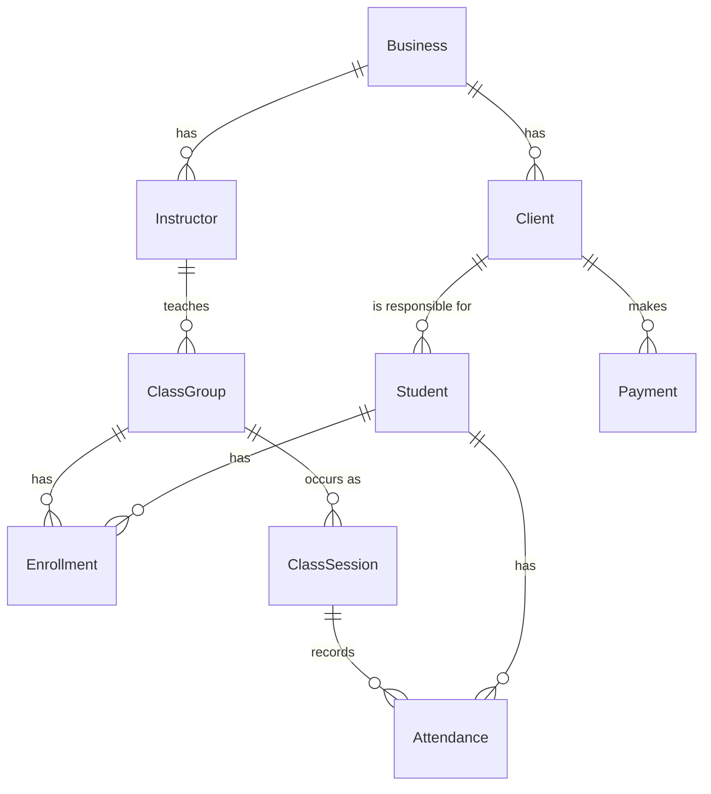

# MVP plan

Build little, but build it well. The MVP proves that an instructor or a small studio (swimming, yoga, pilates, functional training) can run their weekly group classes from a phone: who is enrolled, who came today and who hasn't paid this month, with data fully isolated from other businesses.

## Product decisions

- **Generic code, niche product.** The domain speaks of classes, students, enrollments, attendance and fees, never of pools or mats. What only one discipline needs (swimming levels, medical certificates) comes later as optional features.
- **The tenant is the `Business`** (the instructor or the studio). The name stays generic on purpose: a swimming instructor has no "studio".
- **Recurring group classes, not one-off appointments.** A student enrolls in "Tuesday and Thursday 18:00, 8 spots" once; they don't book each session.
- **Who attends is not always who pays.** Children are enrolled by a parent who pays for all their children.
- **Money is part of the MVP.** Knowing who owes this month's fee is the main reason an instructor leaves the spreadsheet.

## MVP goal

An owner can:

- Sign up with email and password, which creates their business, and sign in from a phone or a browser (already in the template).
- Register clients (the person who pays and is contacted) and their students (the people who attend; an adult client can be their own student).
- Create weekly classes with a name, days and times, duration, capacity and instructor.
- Enroll students in classes, without going over capacity.
- Open today's classes and take attendance.
- Set the monthly fee, record payments and see who owes the current month.
- Trust that no other business can ever see their data.

## Not included in the MVP

- Class packs (for example 8 classes to use in a month); the MVP only has a monthly fee.
- Make-up classes, waitlists and trial classes.
- Medical certificate with expiry date, levels and student progress.
- Accounts for instructors or students, and an online booking link.
- WhatsApp reminders.
- Subscription plans, billing and reports.

## Domain sketch

Detailed rules go in [backend/domain-model.md](backend/domain-model.md) as each milestone lands. The shape:

| Entity | What it is | Key rules |
|---|---|---|
| `Client` | Person who pays and is contacted (from the template) | Phone unique per business |
| `Student` | Person who attends | Belongs to one client; name required; optional birth date and notes |
| `Instructor` | Person who teaches | Can be inactive; the owner is usually the first instructor |
| `ClassGroup` | Weekly recurring class: name, weekdays, start time, duration, capacity, instructor | Capacity at least 1; times in the business's time zone |
| `Enrollment` | A student in a class group from a date, optionally until a date | Active enrollments never exceed capacity; a student enrolls once per group |
| `ClassSession` | One dated occurrence of a class group | Created on demand when attendance is taken or the session is cancelled, not generated ahead |
| `Attendance` | Present or absent for an enrolled student in a session | One per student and session |
| `Payment` | Money received from a client for a month | Amount greater than zero; a month is paid when payments reach the client's fee |

`ClassGroup` avoids `Class`, which reads as the C# keyword. The UI calls it "clase".

Every entity except `Business` is tenant-owned and gets its isolation test.

## Milestones

Status: M1 to M5 done (backend and frontend), plus rescheduling one session on the same day ([plan](backend/20260926-reschedule-session/plan.md)). Next: pilot with one or two real instructors.

Each milestone gets a backend plan and a frontend plan under `docs/backend/<date>-<name>/plan.md` and `docs/frontend/<date>-<name>/plan.md` before code is written.

### M1 — Clients and students

Plans in [backend](backend/20260925-clients-and-students/plan.md) and [frontend](frontend/20260925-clients-and-students/plan.md).

- Adapt the template's `Client` as the payer; add `Student` belonging to a client.
- One form to register an adult who attends (client and student at once) or a parent with one or more children.
- Search students by name.

### M2 — Instructors and class groups

Plans in [backend](backend/20260925-instructors-and-class-groups/plan.md) and [frontend](frontend/20260925-instructors-and-class-groups/plan.md).

- CRUD for instructors and class groups (weekdays, start time, duration, capacity, instructor).
- Weekly view: the classes of each day.

### M3 — Enrollments

Plans in [backend](backend/20260925-enrollments/plan.md) and [frontend](frontend/20260925-enrollments/plan.md).

- Enroll and unenroll a student, with capacity check and a start date.
- A class group shows its students and free spots; a student shows their classes.

### M4 — Attendance

Plans in [backend](backend/20260926-attendance/plan.md) and [frontend](frontend/20260926-attendance/plan.md).

- "Today" screen: today's sessions for the business, in time order.
- Take attendance for a session: enrolled students, present or absent, one tap each.
- Cancel a session (holiday, pool closed) so it doesn't count as an absence.

### M5 — Monthly fees

Plans in [backend](backend/20260926-monthly-fees/plan.md) and [frontend](frontend/20260926-monthly-fees/plan.md).

- Monthly fee per client (default from the business settings, overridable per client).
- Record a payment (amount, date, method, month it pays).
- "Who owes" list for the current month.

After M5: pilot with one or two real instructors ([hosting plan](hosting-plan.md)), then decide between class packs and make-up classes based on what they ask for.

### M6 — Fee history and class packs

Plans in [backend](backend/20260927-fee-history-and-class-packs/plan.md) and [frontend](frontend/20260927-fee-history-and-class-packs/plan.md). Asked by the pilot instructor.

- Fee changes apply from a month on; past months keep their fee.
- Each family pays a monthly fee or per class; a catalog of class packs (single class, 4 classes, 8 classes for 2 months).
- Selling a pack records the payment; attending uses a class; the family shows classes left and unpaid.

## Definition of done (per use case)

- Tests written first (RED), then implementation (GREEN), then cleanup.
- Unit tests cover every business rule; integration tests cover the endpoint contract and tenant isolation.
- No hardcoded strings in logic, no abbreviations, no comments.
- `dotnet build -warnaserror` and `dotnet test` green.
- The screen works on Android and web (Expo) against the local API.

## Open decisions

| Decision | Needed by | Notes |
|---|---|---|
| Fee per client or per student | M5 | Decided: per client, with a default on the business and an optional override per client |
| Reusing scheduling code from salon-manager | M2 | Weekly schedule and time off exist there; copy what M2 needs, extract to the template only when both apps prove it's the same |
| Class packs vs make-up classes first | After the pilot | Decided: class packs first (M6), asked by the pilot instructor |
| Pricing model | Before public launch | Free plan limits (for example number of students) |
