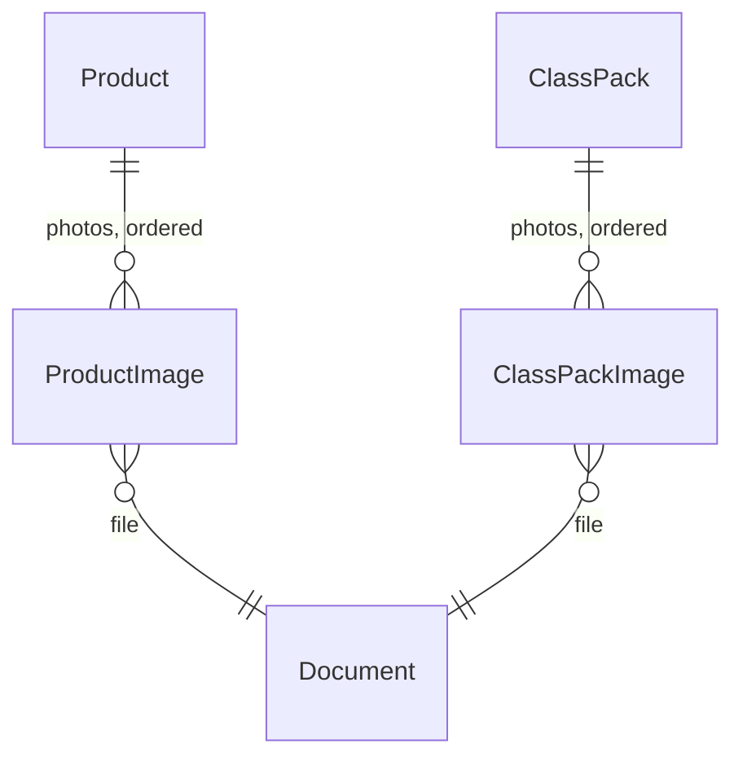

# Storage library and catalog images

Date: 2026-10-03

Product and class pack photos are files in **Azure Blob Storage**. The database keeps one `Documents` row per file (path, content type, size, visibility), never the file itself, and link tables say which product or pack each photo belongs to and in which order. The browser and the phone download public photos straight from Blob Storage, so photos never go through the API or the database.

`src/Storage` and `src/Storage.AzureBlob` are a reusable library like [tenancy](tenancy.md), [notifications](notifications.md) and [import and export](import-export.md). They save, serve and delete files and recognize image formats. They know nothing about products, packs or businesses. ARCH008 keeps them free of `ClassManager.Core`, `Infrastructure`, `Api`, `Security`, `Tenancy`, `ImportExport`, `Notifications` and `Subscriptions` (see [analyzers](analyzers.md)).

## Why Blob Storage, and is anything cheaper

| Option | Storage price (approx., hot tier) | Downloads | Notes |
|---|---|---|---|
| **Azure Blob Storage (LRS, hot)** | about USD 0.02 per GB per month | First 100 GB per month of internet egress free per subscription, then billed per GB | Same Azure subscription and bill as the API and the database. Managed identity can replace the connection string later |
| Cloudflare R2 | about USD 0.015 per GB per month, first 10 GB free | No egress fees | Cheaper, especially if photos are downloaded a lot. It uses an S3-compatible API, so it needs an S3 client and a second set of credentials |
| Database (`varbinary`) | Counts against the 32 GB of the free Azure SQL offer | Every download costs API and database time | Used for the brand logo (one small file per business, up to 512 KB). Wrong for many photos of up to 5 MB |

Prices change; check the Azure Blob Storage and Cloudflare R2 pricing pages before relying on them.

At pilot scale both are almost free. For example, 500 photos of 300 KB are about 150 MB, which costs well under one cent a month on either service. **Decision: Azure Blob Storage**, because the hosting is already on Azure and the setup is simpler. If downloads ever make egress the main cost, write a `Storage.S3` adapter for R2 that implements `IFileStorage` (see [Changing provider](#changing-provider)). Nothing else would change, because the database stores paths, not URLs.

## Contents

### `src/Storage` (no package dependencies)

| Type | Purpose |
|---|---|
| `Files/IFileStorage` | `SaveAsync(FileToStore)`, `DeleteAsync(path, visibility)` (returns `false` when the file is already gone) and `PublicUrlOf(path)` |
| `Files/FileToStore` | Path, content, content type and visibility of a file to save |
| `Files/FileVisibility` | `Public` (anyone with the URL can read it) or `Private` (only the API can read it) |
| `Files/FilePath` | `Combine(segments)` joins path segments with `/` and rejects empty, `.`, `..` and segments containing a slash |
| `Images/ImageFormat` | Detects PNG, JPEG and WebP from the file's first bytes (never trusts the name or the declared type). Also used by the brand logo |

### `src/Storage.AzureBlob` (Azure.Storage.Blobs)

| Type | Purpose |
|---|---|
| `AzureBlobFileStorage` | One container per visibility. Public files get `Cache-Control: public, max-age=31536000, immutable`; private ones `private, no-store`. The first save creates the container if it is missing: the public one with anonymous read access to blobs (not to the container listing), the private one without anonymous access |
| `BlobStorageOptions` | `FileStorage:PublicContainerName` (default `public-files`), `FileStorage:PrivateContainerName` (default `private-files`) and `FileStorage:CacheControl` |
| `FileStorageServiceCollectionExtensions` | `AddAzureBlobFileStorage()` reads the `FileStorage` connection string. It fails when the storage is first used without one, not at startup, so the API and the e2e tests run without storage until a photo is uploaded |

## What stays in the app

| In `Core` | In `Infrastructure` |
|---|---|
| `Document` (path, content type, size, `Visibility`), `ProductImage` and `ClassPackImage` (owner, document, position), `CatalogImage` (format check, 5 MB limit), `CatalogImageGallery` (add, remove, reorder), `ICatalogImageService` (plan limit, store, save, clean up), `IDocumentStorageService` | `DocumentStorageService`: builds the path, saves through `IFileStorage`, turns a public document into its URL, and logs (does not throw) when a delete fails. EF configuration of `Documents`, `ProductImages` and `ClassPackImages` |

### Model



- **One table for every file, link tables per owner.** `Documents` describes files; `ProductImages` and `ClassPackImages` link them with real foreign keys and a `Position`. A generic `OwnerType` + `OwnerId` column would have no foreign key, so the database could not stop orphaned or wrong links. A new kind of owner (a class photo, a student certificate) is one more link table.
- **The path is stored, not the URL.** URLs are built when answering (`PublicUrlOf`). Moving to a CDN or another provider changes configuration, not data, and private documents can get signed links later without a migration.
- **Visibility.** Shop photos are `Public`. `Private` exists so private documents (medical certificates, IDs) can use the same table and storage later: they go to the private container, and serving them needs short-lived signed links (SAS), which are not built yet. `PublicUrlOf` refuses private documents.
- **Paths** are `<tenantId>/<products|class-packs>/<ownerId>/<documentId>.<extension>`. Each upload gets a new name, so the long cache header is safe.
- **Plan limit.** The number of photos per product or pack is the `catalog-photos` feature: 1 on `Free`, 5 on the other plans, and an add-on can raise it ([subscriptions plan](backend/20261003-subscriptions/plan.md)). Like every limit, it blocks adding past it, never existing photos.

### Endpoints

Same for `/api/class-packs/{id}`, with the permissions to edit the product or the pack:

| Endpoint | What it does |
|---|---|
| `POST /api/products/{id}/images` | Adds a photo at the end. 400 `image.unsupported` or `image.too_large`, 403 `feature.limit_reached` |
| `DELETE /api/products/{id}/images/{documentId}` | Removes the link, the `Documents` row and the file. 404 `image.not_found` if the photo is not this product's |
| `PUT /api/products/{id}/images/order` | `{ "documentIds": [...] }` with every photo exactly once; the first is the main photo. 400 `image.order_mismatch` otherwise |

Responses carry `images: [{ id, url }]` in order. Adding uploads the file first and then saves the rows; if saving fails, the file just uploaded is deleted. Tenant query filters make another business's product, pack or document a 404.

The app keeps photo changes in the form and sends them when the user taps Guardar: removals, then additions in order, then the order if it changed. If the plan limit stops an addition, the product is saved and a message says some photos were not uploaded.

**Public photos can be opened by anyone with the URL.** URLs contain random ids and can't be guessed or listed, and shop photos are meant to be seen by students.

## Class material files

A class has one optional material for its students: a link (`MaterialUrl`) or an uploaded PDF (`MaterialDocumentId`, a nullable foreign key to `Documents`), never both (check constraint `CK_ClassGroups_OneMaterial`). A single file needs no link table, so it is a column on `ClassGroups` with a filtered unique index.

| Endpoint | What it does |
|---|---|
| `POST /api/class-groups/{id}/material` | Uploads a PDF (detected by its `%PDF-` signature, never by name, up to 20 MB). Clears the link and deletes the previous file. 400 `class_group.material_unsupported` or `class_group.material_too_large` |
| `DELETE /api/class-groups/{id}/material` | Removes the file. 404 `class_group.material_file_not_found` if there is none |
| `PUT /api/class-groups/{id}` with a `materialUrl` | Sets the link and deletes the file, if any |

Paths are `<tenantId>/class-groups/<classGroupId>/<documentId>.pdf`. The student app returns the file's public URL in place of the link, so students open both the same way.

**Material files are public, like shop photos.** Decision (2026-10-08): a signed, short-lived link would only stop students from sharing the URL; they can still download the PDF and pass it on, as they can with printed material or a public Drive link. Private files stay for sensitive documents (medical certificates, IDs).

The app keeps the file change in the form and sends it on Guardar: the removal first, then the class, then the upload. If the upload fails the class is still saved and a message says the PDF was not uploaded.

## Configuration

| Setting | Value |
|---|---|
| `ConnectionStrings:FileStorage` | Storage account connection string (secret) |
| `FileStorage:PublicContainerName`, `FileStorage:PrivateContainerName` | Optional, defaults `public-files` and `private-files` |
| `FILES_BASE_URL` (web build) | Optional. The blob endpoint, for example `https://<account>.blob.core.windows.net`. `app/scripts/writeWebHeaders.js` adds its origin to `img-src` in the [Content Security Policy](frontend/content-security-policy.md) |

### Local development

Run Azurite, the Blob Storage emulator, next to the development database:

```powershell
podman run -d --name class-manager-azurite -p 10000:10000 mcr.microsoft.com/azure-storage/azurite azurite-blob --blobHost 0.0.0.0 --skipApiVersionCheck
dotnet user-secrets set "ConnectionStrings:FileStorage" "UseDevelopmentStorage=true" --project src/Api
```

Afterwards, `podman start class-manager-azurite` is enough. `--skipApiVersionCheck` is needed because the Azure SDK is often newer than the latest Azurite release.

### Azure

```powershell
az storage account create --name <account> --resource-group <group> --location <region> --sku Standard_LRS --kind StorageV2 --access-tier Hot --min-tls-version TLS1_2 --allow-blob-public-access true
az storage account show-connection-string --name <account> --resource-group <group> --query connectionString -o tsv
az containerapp secret set --name <api app> --resource-group <group> --secrets file-storage="<connection string>"
az containerapp update --name <api app> --resource-group <group> --set-env-vars ConnectionStrings__FileStorage=secretref:file-storage
```

New storage accounts block anonymous access by default. `--allow-blob-public-access true` turns it on for the account; it only applies to containers created with public access, so `private-files` stays private. The API creates both containers on first use. Then set `FILES_BASE_URL` in Cloudflare Pages to `https://<account>.blob.core.windows.net`.

Costs to watch: storage used and egress, both in the Azure cost analysis of the storage account. Orphaned files only appear when a delete fails (see the `could not be deleted and stays orphaned` warning in the logs). They cost almost nothing and can be removed by hand.

## Tests

| Project | What it covers |
|---|---|
| `tests/ClassManager.Storage.U.Tests` | Image format detection and path rules |
| `tests/ClassManager.Storage.I.Tests` | `AzureBlobFileStorage` against Azurite in Testcontainers: public download, content type, cache header, paths with spaces, private files not readable anonymously and not in the public container, delete, missing connection string |
| `tests/ClassManager.Core.U.Tests` | `CatalogImage` validation, removing and reordering photos, the plan limit, deleting the new file when saving fails |
| `tests/ClassManager.Api.I.Tests` | Endpoints against SQL Server and Azurite: add, order, reorder, remove (row and file), invalid and oversized files, permissions, the `Free` limit and the add-on, business B can't add or remove business A's photos, photos in the student shop, and tenant filters on `Documents`, `ProductImages` and `ClassPackImages` |

`ApiFixture` starts Azurite next to SQL Server and passes its connection string to the API. Both containers are started with Podman (see [CLAUDE.md](../CLAUDE.md)).

## Changing provider

1. Add `src/Storage.<Provider>` with a class that implements `IFileStorage`, and a `Add<Provider>FileStorage()` extension.
2. Copy the tests in `tests/ClassManager.Storage.I.Tests` against that provider's emulator (MinIO for S3 and R2).
3. Replace `AddAzureBlobFileStorage()` in `InfrastructureServiceCollectionExtensions`.
4. Copy the existing files keeping their paths. The database stores paths, so no row changes.
